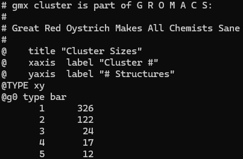

# Clustering Analysis

## Introduction

**Cluster analysis** is used to identify dominant morphologies, or protein conformations, during the duration of an MD simulation. The `gmx cluster` command allows us to reduce trajectories into a few representative structures by clustering, or grouping, conformations that are structurally similar based on a given RMSD cut-off.

You should have the following files:

* Trajectory file (.xtc)
* Topology file (.tpr)
* Index file (.ndx) - OPTIONAL

## Using `gmx cluster`

This command generates multiple outputs, so it is advisable to create a new directory to store these files.

To use perform clustering analysis:

```bash
gmx cluster -f trajectory.xtc -s topology.tpr -n index.ndx -method gromos -cutoff 0.2 -o rep_clust.xpm -g rep_clust.log -cl rep_clust.pdb -sz rep_size.xvg
```

The `-method` option specifies the clustering algorithm, typically the `gromos` algorithm. The `-cutoff` option indicates the RMSD boundary (in nm) for structures to be considered similar enough to be clustered.

Clustering should be performed after your system achieves convergence(1), so you will need to supply a starting time using `-b`. The duration that you are analyzing is considered your sampling period.
{ .annotate }

1. See [Root Mean Square Deviation and Fluctuation](gmx-rms.md)

Some additional options that you may find useful:

* `-n`: index file to be used (see [Creating Index Files](gmx-ndx.md))
* `-tu`: specifies time units (default is ps; ns is recommended)
* `-b` and `-e`: specifies the frames to <ins>b</ins>egin and <ins>e</ins>nd

---

Running the command will prompt you to select two groups. Select `Backbone` for least squares fit and RMSD. When prompted to select an output group, select the group that includes everything you intend to visualize. This will often be just the protein (`Protein`), but you may also want to include any additional molecules (e.g., ligands), depending on your simulation. Note that more complex outputs will require a custom index file.

This produces the following outputs:

* `-o`: RMSD matrix
* `-g`: information on clusters and the frames in those clusters
* `-sz`: distribution of cluster size
* `-cl`: PDB file of representative structures from each cluster

Detailed information on the clustering, such as average RMSD and specific frame sorting, can be found in the LOG file generated by `-g`. The PDB file contains representative structures for each cluster identified and is used for PyMOL visualizations.

## Identifying dominant morphologies

The size distribution generated by `-sz` helps us determine which protein conformations are the most common across the sampling period. Similar to the LOG file, this file lists all clusters identified by the `gmx cluster` command, as well as the number of frames contained in that cluster. Note that the first cluster will always have the most frames.

<figure markdown="span">
    
    <figcaption>Cluster size distribution of one simulation.</figcaption>
</figure>

In our example, we see that 5 clusters were identified. Cluster 1 contains 326 frames out of 501, which seems like a significant portion of the sampling period.

### Calculating cluster occupancy

Cluster occupancy is a quantitative measure of how often a cluster's conformation occurs during the sampling period. At minimum, the threshold is 50% occupancy for a cluster to be dominant. If your first cluster has less than 50% occupancy, you may need to increase your `-cutoff` value and rerun the command.

To calculate occupancy of a cluster, divide the total number of frames by the number of frames in the first cluster, then multiply by 100.

<figure markdown="span">
    { width="400" }
</figure>

Returning to the previous example, 326 frames of 501 occupies approximately 65.1% of the sampling period, which is above the 50% threshold.

## Additional Resources

* [gmx cluster](https://manual.gromacs.org/current/onlinehelp/gmx-cluster.html)