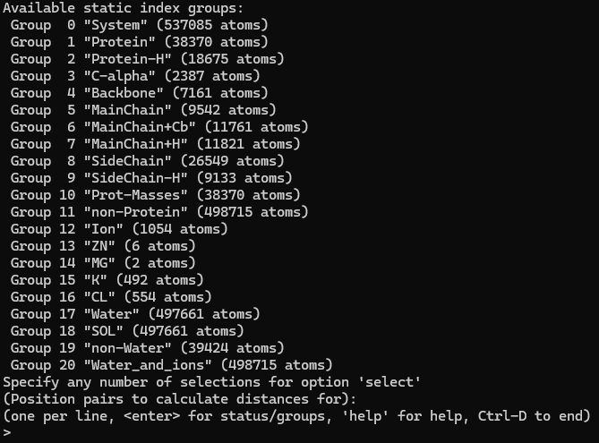

# Measuring Distances

## Introduction

GROMACS has a few commands that can calculate the distance between atoms or groups of atoms:

`gmx distance` calculates distances between fixed pairs of atoms. This is useful if you are interested in specific residues involved in processes, like protein-ligand interactions.

`gmx mindist` calculates the *minimum* distance and number of contacts between pairs of atoms.

!!! note
    You will need to use a [custom index file](gmx-ndx.md) if you are measuring distance between custom groups of atoms.

You should have the following files for both commands:

* Trajectory files (.xtc)
* Topology file (.tpr)
* Index file (.ndx)

## Using `gmx distance`

To calculate distances between fixed pairs:

```
gmx distance -f trajectory.xtc -s topology.tpr -n index.ndx -tu ns -select 'first group' 'second group' '...' -oav avg-dist.xvg -oxyz comp-dist.xvg
```

`-select` allows you to directly indicate which groups you want to analyze, which is convenient for slurm scripts. If the `-select` option is not used, you will be presented with a group selection menu after running the command.

<figure markdown="span">
  { width="540" }
</figure>

Note that `gmx distance` can take more complex selections than what is typical of standard index files. Enter `help examples` in the prompt for examples.

This produces the following outputs:

* `-oav`: average distances as a function of time
* `-oxyz`: distance components (x-/y-/z-axis) as a function of time

## Using `gmx mindist`

To calculate the minimum distance between pairs:

```
gmx mindist -f trajectory.xtc -s topology.tpr -n index.ndx -d <nr> -tu ns -od mindist.xvg -on count.xvg -or mindist-res.xvg -group
```

`-group` tells GROMACS that all contacts between one atom in a group and multiple atoms of the other group should be considered a single contact. `-d` specifies the distance cut-off in angstroms for a pair to be considered in contact.

You will then be prompted to select two groups to measure distances between.

This produces the following outputs:

* `-od`: minimum distances between pairs of atoms
* `-on`: number of contacts between pairs of atoms
* `-or`: minimum distances to residues in group 1, plotted as a function of residue number

## Additional Resources

* [gmx distance](https://manual.gromacs.org/current/onlinehelp/gmx-distance.html)
* [gmx mindist](https://manual.gromacs.org/current/onlinehelp/gmx-mindist.html)