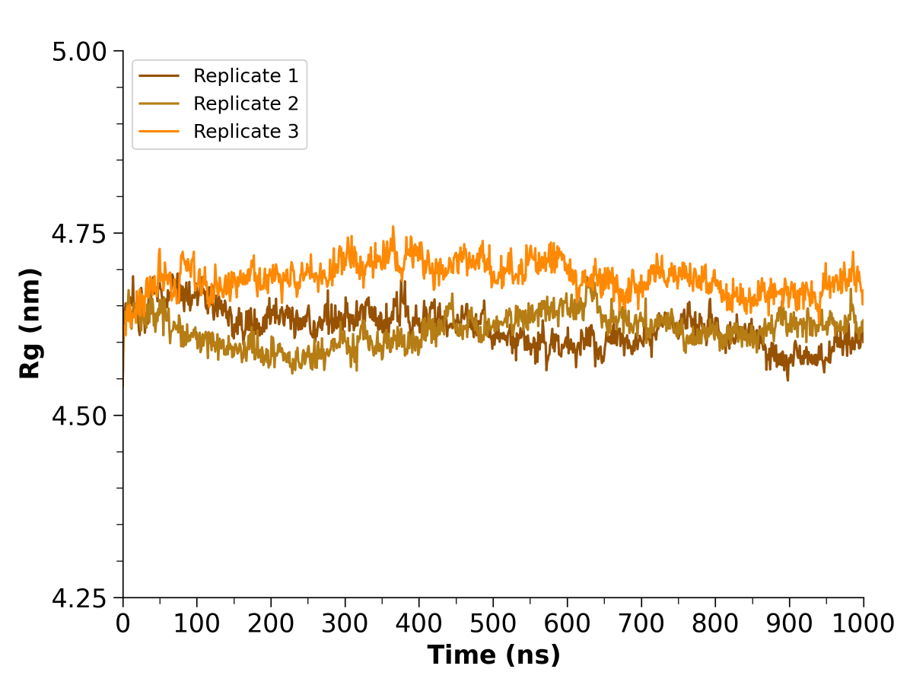

# Radius of Gyration (R~g~)

## Introduction

**Radius of Gyration (R~g~)** is a measure of protein size and compactness across the duration of the simulation. Fluctuations in R~g~ can also indicate protein flexibility and stability, where dramatic increases in R~g~ may suggest unfolding or expansion. R~g~ can be calculated using `gmx gyrate` and is generally reported as nanometers (nm) plotted against time.

<figure markdown="span">
  { width="540" }
  <figcaption>R<sub>g</sub> graph from one set of simulations. R<sub>g</sub> is plotted as nanometer (nm) versus time (ns).</figcaption>
</figure>

You should have the following files:

* Trajectory files (.xtc)
* Topology file (.tpr)

!!! note
    `gmx gyrate` was changed in the 2024 version of GROMACS. This page references the command as it was in prior releases.

## Using `gmx gyrate`

To calculate radius of gyration:

```
gmx gyrate -f trajectory.xtc -s topology.tpr -o gyrate.xvg
```

???+ tip "Other options you may find useful"

    * `-n`: index file to be used (see [Creating Index Files](gmx-ndx.md))
    * `-b` and `-e`: the frames to <ins>b</ins>egin and <ins>e</ins>nd

When prompted, select the group you want to analyze. This will likely be `Backbone` or another special group, like for individual chains. Note that special groups will require a custom index file to be supplied with `-n`.

This will output an XVG file of R~g~ versus time that can be visualized using Grace or Python.

## Additional Resources

* [gmx gyrate](https://manual.gromacs.org/2023-current/onlinehelp/gmx-gyrate.html)