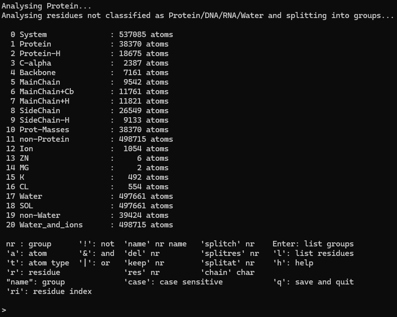
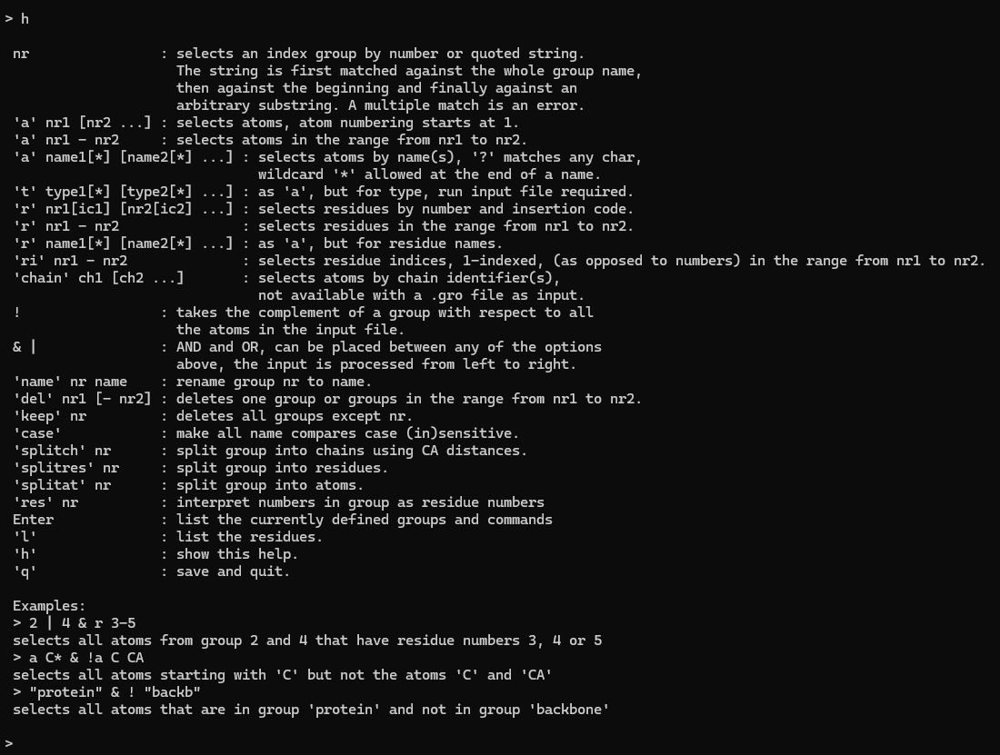

# Creating Index Files

## Introduction

Sometimes we are interested in only analyzing specific parts of a protein in a simulation. **GROMACS index files (NDX)** contain information on atom groups such as protein-associated atoms, ions, and other molecules (e.g., ATP or ADP). Index files are used with the `-n` option in various GROMACS modules to analyze portions of your protein.

By default, GROMACS will use a preset of groups if no index file is supplied.

We can make custom index files for special groups through the `gmx make_ndx` command.

You should have the following files:

* Topology file (.tpr)

## Using `gmx make_ndx`

To create an index file:

```bash
gmx make_ndx -f topology.tpr -o output.ndx
```

You can additionally supply a pre-existing index file to modify using the `-n` option.

In either case, you will be presented with the index editor containing default atom groups, grouping options, and a prompt to enter commands (`>`).



Entering `q` at this point will save a NDX file containing only default groups.

### Navigating the index editor

To create special groups, we will need to use the grouping options. Type `h` to show the help menu.



The help menu explains how to use each grouping option. It also provides a few examples at the bottom showing how to use multiple options with operators (`! & |`).

Hitting `ENTER` with an empty command prompt will repopulate the group list and bring you to the original menu.

---

Generally, you will not need to do overly complicated index file manipulation.

To select a range of atoms, like the first 100:

```
a 1-100
```

Similarly, for the first 100 residues:

```
r 1-100
```

---

You can also mash commands together using operators (`! & |`).

To select the backbone and side-chain hydrogen atoms of residues 300 to 350, but not residue 325:

```
4 | 9 & r 300-350 & ! r 325
```

Breaking this command down:

* `4 | 9` selects all atoms that are part of either groups 4 OR (`|`) 9.
    * Using AND (`&`) here will return an empty group, as `&` looks for atoms shared by both groups.
* `& r 300-350  & ! r 325` selects residues 300 to 350 and NOT (`& !`) residue 325.

Note that if your protein has multiple chains, `r <residue number>` will select all residues with that number. To select residues in specific chains only, you will need to create chain-only groups first.

### Splitting protein chains

A common way of using `gmx make_ndx` is to create special groups for protein chains. The `splitch <group number>` option splits the protein into chains that contain only atoms from the specified group.

In the group list above, the entire protein is defined in Group 1 and the backbone is defined in Group 4.

`splitch 1` will create individual groups for each protein chain. These groups will contain all atoms of that chain, including those in side-chains.

`splitch 4` will also create individual groups per chain, but these groups will only contain the atoms of the protein backbone.

<figure markdown="span">

</figure>

This particular protein has six chains. After repopulating the group list with `ENTER`, we see both grouping options created six groups each, with `splitch 1` groups boxed in red (21 to 26) and `splitch 4` boxed in yellow (27 to 32).

!!! note
    Splitting actions like `splitch`, `splitat`, and `splitres` cannot be used with other options or operators. Instead, these must be executed sequentially.

## Additional Resources

* [gmx make_ndx](https://manual.gromacs.org/current/onlinehelp/gmx-make_ndx.html)