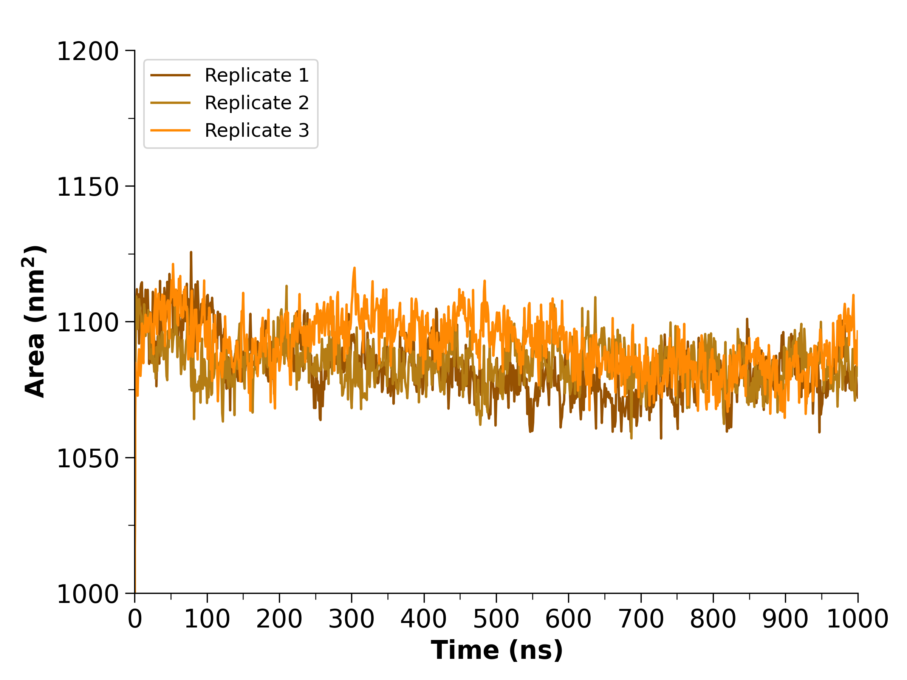

# Solvent Accessible Surface Area (SASA)

## Introduction

**Solvent accessible surface area (SASA)** is a measure of how much a protein's surface is able to contact the system's solvent. SASA is reported in square nanometers (nm^2^) and can be plotted against time. Similar to [radius of gyration](gmx-gyrate.md), changes in SASA over time may indicate protein flexibility and stability.

<figure markdown="span">
  { width="540" }
  <figcaption>SASA graph from one set of simulations. SASA is plotted as square nanometer (nm<sup>2</sup>) versus time (ns).</figcaption>
</figure>

You should have the following files:

* Trajectory files (.xtc)
* Topology file (.tpr)

## Using `gmx sasa`

To calculate the solvent accessible surface area:

```
gmx sasa -f trajectory.xtc -s topology.tpr -tu ns -o sasa.xvg -tu ns
```

???+ tip "Other options you may find useful"
    * `-n`: index file to be used (see [Creating Index Files](gmx-ndx.md))
    * `-b` and `-e`: the frames to <ins>b</ins>egin and <ins>e</ins>nd
    * `-tv`: outputs the total volume and density as a function of time

When prompted, select the group that you wish to analyze.

This will output an XVG file of total SASA versus time that can be visualized using Grace or Python.

## Additional Resources

* [gmx sasa](https://manual.gromacs.org/current/onlinehelp/gmx-sasa.html)