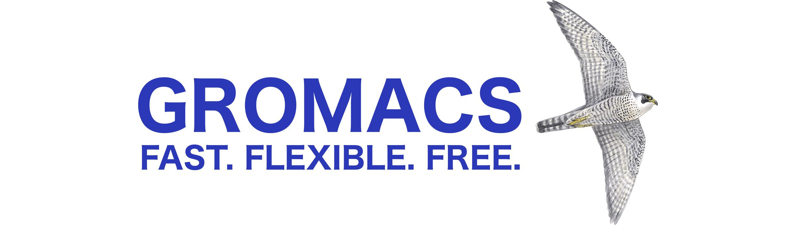

# GROMACS Homepage

<figure markdown="span">
    
</figure>

**GROMACS** is an open-source software package used to simulate the dynamics of lipids, nucleic acids, and proteins. It is capable of using a variety of forcefields—AMBER, CHARMM, OPLS, GROMOS—and is one of fastest MD packages for biomolecules. You can use GROMACS via the Advanced Research Computing clusters here at Virginia Tech.

The following pages are guides for some of the GROMACS functions used the most often in this lab. Each provides an overview of the purpose of each command, what outputs you could expect, and how to generally use each command. While each guide may have a particular scenario in mind, all commands can likely be adapted to your systems as needed.
