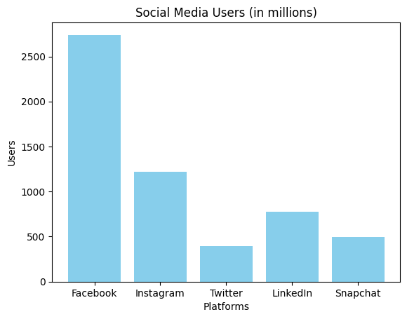

# matplotlib

## Bar charts
```py title="python" linenums="1"
import matplotlib.pyplot as plt

# Social media platforms and their user counts (in millions)
platforms = ['Facebook', 'Instagram', 'Twitter', 'LinkedIn', 'Snapchat']
users = [2740, 1220, 396, 774, 498]

# Creating the bar chart
plt.bar(platforms, users, color='skyblue')

# Adding title and labels
plt.title('Social Media Users (in millions)')
plt.xlabel('Platforms')
plt.ylabel('Users')

# Display the chart
plt.show()
```

